# Lesson 1 Homework
  
## Z 

### Intelligence-Driven Computer Network Defense Informed by Analysis of Adversary Campaigns and Intrusion Kill Chains

* Conventional defence tools focusing on post-detection actions and trying to fix flaws after succeful intrusions have become obsolete as the adversaries have evolved their methods.  
* Advanced Persistent Threat (APT) is a class of threat focused on compromising data for economic or military gains. These actors utilize methods that cannot necessarily be patched or detected by AV software.  
* Intrusion Kill Chain describes the step by step process an adversary follows in order to achieve his goals from gathering information to completing the objective in seven phases:
    1. Reconnaisance  
    2. Weaponization  
    3. Delivery  
    4. Exploitation  
    5. Installation  
    6. Command and Control (C2)  
    7. Actions on Objectives  
* The idea described in the article is for the defender to disrupt any of these Kill Chain steps to make the attacker fall back then collect data from both mitigated and unmitigated attacks to develop more effective measures for future.  
    * The process being a chain means that when one link/step fails the process as a whole fails. 
* Persistent attack requires a persistent defence. By gathering and carefully analyzing intelligence from former attacks the defender can:
    * Develop new ways of mitigation against future intrusions.  
    * Identify persistent intrusion campaigns.  
        * Possibly identify the adversaries and their goals.  
    * Make the adversaries goals seem less lucrative by having them continually change or develop methods and tools.  

### Karvinen 2020: [Command Line Basics Revisited](https://terokarvinen.com/2020/command-line-basics-revisited/)

* Useful article to revisit the basic commands. Will definitely bookmark this as my Command Line talk is a bit rusty.  

### Karvinen 2021: [Install Debian on VirtualBox](https://terokarvinen.com/2021/install-debian-on-virtualbox/)

* Definitely a useful article. 
* Definitely something I maybe should've read before starting with the installations but I managed and ended up doing pretty much the same steps.
* The GRUB menu pre-boot edit part was something I haven't looked in to before. Didn't have to know but it goes in the "nice to know" -category

### Karvinen 2021: Install Webgoat 8 - [Learn Web Pentesting](https://terokarvinen.com/2020/install-webgoat-web-pentest-practice-target/)

* See assignment [C](#c-webgoat-install-webgoat-practice-target)

## A and M Bandit oh-five. Solve Over The Wire: Bandit the first five levels (0-7).

As requested in the Over The Wire instructions I will not post the exact commands used to get the passwords.
So here is a bunch of screenshots:  
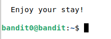
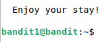
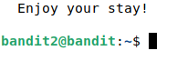
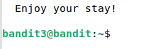
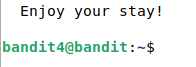
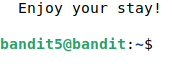
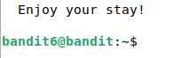
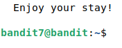  

If asked, I can provide the methods.

## B Bullseye. Install Debian 11-Bullseye virtual machine in VirtulBox.

I am already dual-booting Debian 11 with Windows 10 but decided to install it also on Virtualbox because the WebGoat application recommends being disconnected from Internet while it's running. I can have my Internet on the host computer.  

I have never before installed Virtualbox on Linux (and it has been a while for Windows also) so had to use a [guide](https://linoxide.com/how-to-install-virtualbox-on-debian-11/) for it. Í chose the wget and apt install route and the installation ran through without a hitch.  

After checking that Virtualbox actually runs, I downloaded the Debian 11 64 bit image.  

A problem occurred.. All the OS options for creating a new VM where for 32-bit systems. A little [Duck](https://duckduckgo.com) told me a quick BIOS visit would remedy the situation.

Rebooted and frantically manhandled all the F-keys to open the settings. All it took was enabling the virtualization setting under Security tab.

Back to Virtualbox and the setup was easypeasy. 64 bit Debian 11.  
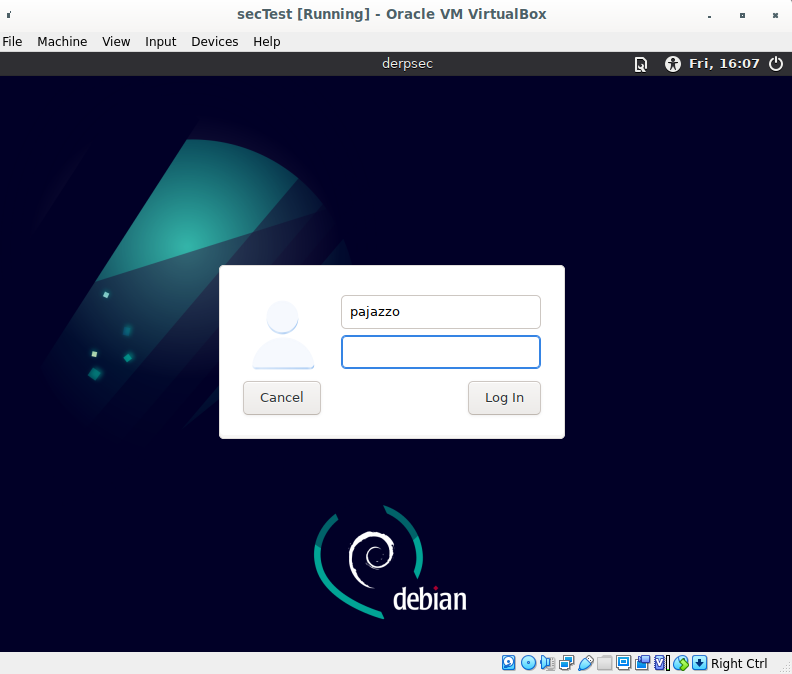

Ended up also installing the VirtualBox Guest additions[https://kifarunix.com/install-virtualbox-guest-additions-on-debian-11/] to have more control. Mainly to control the VM resolution from the menus.  

Noticed afterwards that Tero had an [article](https://terokarvinen.com/2021/install-debian-on-virtualbox/) about the installation. Should have probably done the assignments in order or read the tips before starting. Noted for future.  

## C WebGoat. Install WebGoat practice target.

Followed the steps in the provided link and article. No problem here. Good article.  

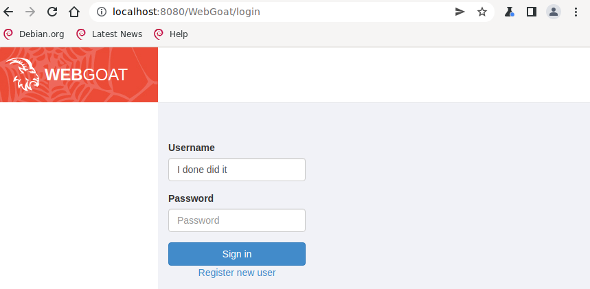

## D Hacker warmup. Solve these tasks on WebGoat

### General: HTTP Basics
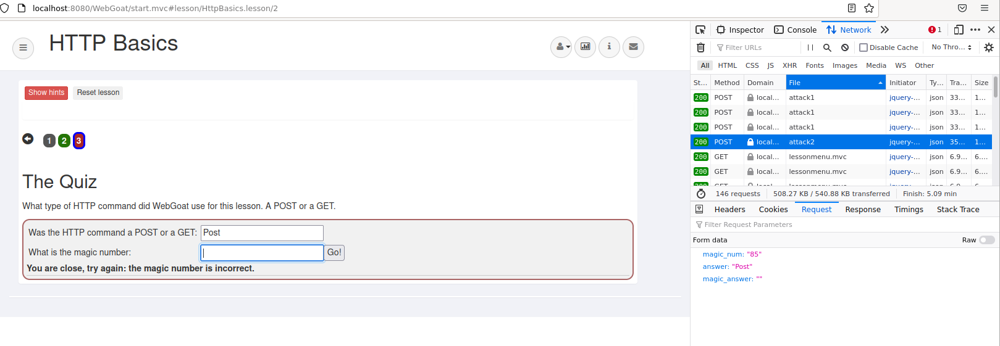  
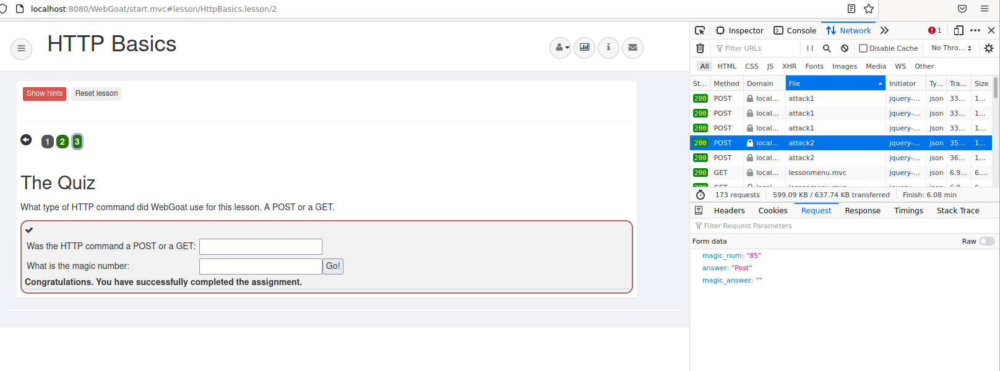  

This one was a bit confusing because as I got to part 3, I knew that POST method was used without really checking anywhere. The magic number confused me as under the Developer Tools Network tab there was only attack1 and no magic numbers in the request or any other sections. I searched... I gave up.  

After submitting POST as answer one, leaving the number blank and getting the Fail -message an attack2 event appeared with the correct answer. Victory.

### General: Developer Tools
This part I was already very familiar with as I have built a few websites in the past. Pictures tell the story.

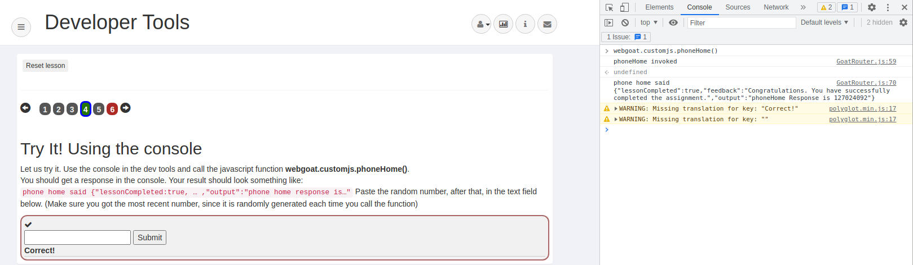  
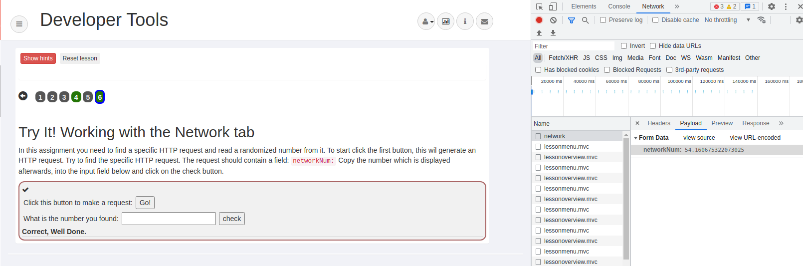  

## N

## O Voluntary bonus: Johnny Tables. Solve Webgoat: A1 Injection (intro).

I will only post the notes for the parts that require user input here.

### 2

You can get the required department with a simple code:
SELECT department FROM employees WHERE last_name LIKE 'Franco' AND first_name LIKE 'Bob'  

Even easier would be to just go:  
SELECT deparment FROM employees WHERE userid=96134  
But I thought I might not know mr. Franco's userid as it was not provided in the assignment.  

### 3 DML (Data Manipulation Language)

Includes the most common SQL commands like SELECT, INSERT, UPDATE, DELETE etc.  

Violations:  
Confidentiality and Integrity

Solution:  
UPDATE employees SET department = 'Sales' WHERE first_name LIKE 'Tobi' AND last_name LIKE 'Barnett'  
USERID	FIRST_NAME	LAST_NAME	DEPARTMENT	SALARY AUTH_TAN  
89762	Tobi	Barnett	Sales	77000	TA9LL1

### 4 DDL (Data Definition Language)

Creation (CREATE), modifying (ALTER), and dropping (DROP) the structure of database objects.  

Violations:  
Integrity and Availability  

Solution:  
ALTER TABLE employees ADD phone varchar(20);  

### 5 DCL (Data Control Language)

Create privileges to allow users to access and manipulate the database.  
Provide security to database objects.  

Commands like GRANT and REVOKE.  

Violation: Confidentiality and Availability  

Solution:  
GRANT ALTER TABLE TO 'UnauthorizedUser';  

### 9

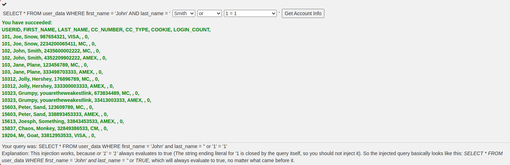  

### 10  

Could not parse: 0 OR 1=1 to a number  
This returned after trying to pass NaN values to Login_Count. This one might be protected.  

Afterwards tried the values:  
Login_Count = 0  
userid = 0 OR 1=1  

Success.  
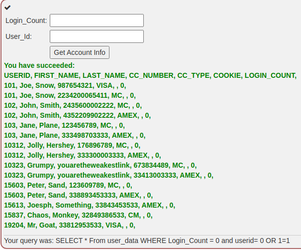

### 11

This was a trial and error run again for me.  
At first I just looked into what my, John Smith's, data looks like.  
Then I had some trouble with the syntax. How to place the quotation marks in the injected code.  
Tried with input:  
Name: Smith' OR 'i'='i'  
TAN: 3SL99A  
This resulted in a failure "malformed string". So I decided to take closer look at the original query:  
"SELECT * FROM employees WHERE last_name = '" + name + "' AND auth_tan = '" + auth_tan + "';  
Placing my little piece here it would look like:  
"SELECT * FROM employees WHERE last_name = 'Smith' OR 'i'='i'' AND auth_tan = '3SL99A';  
The issue can be clearly seen in the extra quotation mark after the second 'i'. Even if fixed, the auth_tan would ruin my attempt so a revised version:  
Input: Smith' OR 'i'='i  
TAN: 3SL99A' OR 'i'='i  
The full query is:  
"SELECT * FROM employees WHERE last_name = 'Smith' OR 'i'='i' AND auth_tan = '3SL99A' OR 'i'='i';  
  
This one was a success as both test are always true but I did leave some traces of my actions as I used my actual name and TAN number with the injections. I could have input any random strings to be safe. Too late now.  
  
The column headers for later use:  
USERID	FIRST_NAME	LAST_NAME	DEPARTMENT	SALARY	AUTH_TAN  

### 12

This one was a pretty straight forward one after realizing the the syntax in the previous.  
So the original query again:  
"SELECT * FROM employees WHERE last_name = '" + name + "' AND auth_tan = '" + auth_tan + "';  
Input:  
Name: Fairy  
TAN: Godmother'; UPDATE employees SET salary=99000 WHERE auth_tan='3SL99A  
The query being sent to the server would look like this:  
SELECT * FROM employees WHERE last_name = 'Fairy' AND auth_tan = 'Godmother'; UPDATE employees SET salary=99000 WHERE auth_tan='3SL99A'  
  
A big payraise for John Smith succesful.  

### 13
  

