# Lesson 2 Homework

Oh, wasp!  

Remember to keep it safe, legal and ethical. Especially if you grasp OWASP 10, you still can't try these to machines you don't own.  

## z) Read and summarize (This subtask z does not require tests with a computer. Some bullets per article is enough for your summary, feel free to write more if you like)  

### OWASP: OWASP 10 2021  
#### [A05:2021-Security Misconfiguration](https://owasp.org/Top10/A05_2021-Security_Misconfiguration/)
   
#### [A06:2021-Vulnerable and Outdated Components](https://owasp.org/Top10/A06_2021-Vulnerable_and_Outdated_Components/)
  
#### [A03:2021-Injection](https://owasp.org/Top10/A03_2021-Injection/)

  
### Any episode from [Darknet Diaries](https://darknetdiaries.com/).  
  
### Pick a CVE, and briefly explain it & why it matters  
  
## a) Sequel. Solve [SQLZoo](https://sqlzoo.net/wiki/SQL_Tutorial):

### 0 SELECT basics  

1. SELECT population FROM world  
      WHERE name = 'Germany' 
    Population: 80716000  
2. SELECT name, population FROM world  
      WHERE name IN ('Sweden', 'Norway', 'Denmark');  
    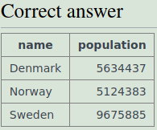  
3. SELECT name, area FROM world  
      WHERE area BETWEEN 200000 AND 250000  
    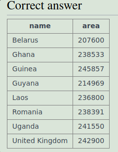

### 2 SELECT from World  

1.  
  
2. SELECT name FROM world  
      WHERE population >= 200000000  
    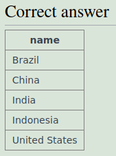  
3. SELECT name, (gdp / population) as 'per capita GDP' FROM world  
      WHERE population >= 200000000  
    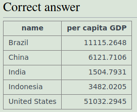   
4. SELECT name, (population / 1000000) as 'pop/mil' FROM world  
      WHERE continent LIKE 'South America'  
    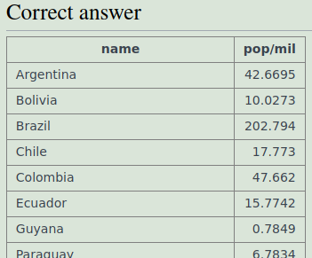  
5. SELECT name, population FROM world  
      WHERE name IN ('France', 'Germany', 'Italy')  
    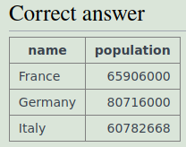  
6. SELECT name FROM world  
      WHERE name LIKE '%United%'  
    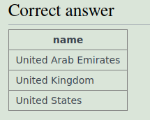  
7. SELECT name, population, area FROM world  
      WHERE area > 3000000 OR population > 250000000  
    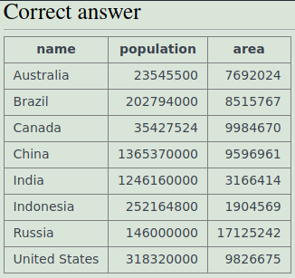  
8. SELECT name, population, area FROM world  
      WHERE area > 3000000 XOR population > 250000000  
    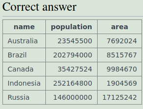  
9. SELECT name, ROUND(population/1000000, 2) as 'pop/mil', ROUND(gdp/1000000000, 2) as 'gpd/bil' FROM world  
      WHERE continent LIKE 'South America'  
    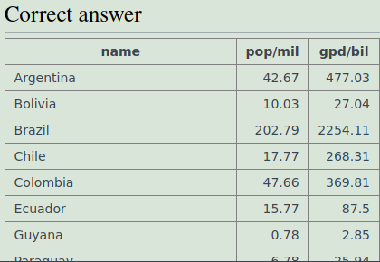  
10. SELECT name, ROUND(gdp/population, -3) as 'gdp/pop' FROM world  
      WHERE gdp >= 1000000000000  
    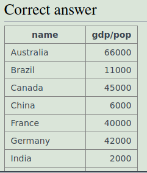   
11. SELECT name, capital FROM world  
      WHERE LENGTH(name)=LENGTH(capital)  
    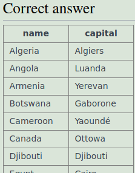  
12. SELECT name, capital FROM world  
      WHERE LEFT(name, 1) = LEFT(capital, 1)  
      AND name <> capital  
    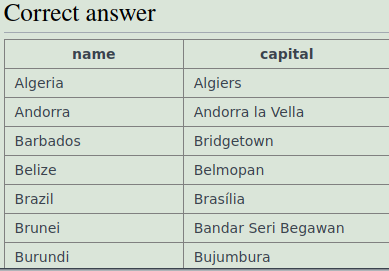  
13. SELECT name FROM world  
      WHERE name LIKE '%a%'  
        AND name LIKE '%e%'  
        AND name LIKE '%i%'  
        AND name LIKE '%o%'  
        AND name LIKE '%u%'  
        AND name NOT LIKE '% %'  
    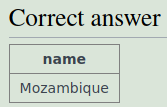  

## b) Injected. Solve WebGoat:  

### A1 Injection (intro)  

## m) Voluntary bonus: Pick your tasks from SQLZoo 1, 3-9.    

## n) Voluntary difficult bonus: WebGoat: SQL Injection (advanced).  

  
## Voluntary difficult bonus: Install a relational database, show CRUD operations using SQL  
  
    
## q) Voluntary difficult bonus: Demonstrate aggregate functions (SUM, COUNT) with your own data you created in the previous step.  

  
## p) Voluntary difficult bonus: Install a practice target for SQL injections, exploit it.  

  
## r) Voluntary difficult bonus: Demonstrate JOIN with your own database  

