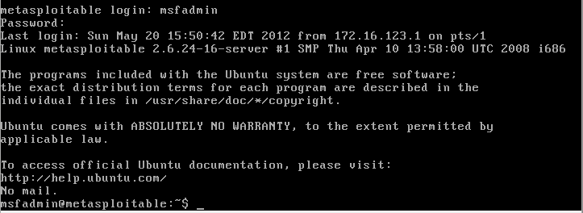
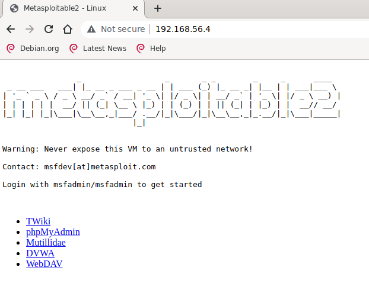

# Lesson 4 Homework

Part of Data Security ICT4TF022-3008 course of Haaga-Helia University of Applied Sciences held by Tero Karvinen.  
Link to course page [Here](https://terokarvinen.com/2021/data-security-2022p3-ict4tf022-3008/)

## Intelligence gap

Be careful with the tools. Only use tools to practice targets inside practice
networks separated from the internet. Just port scanning someone else's
computer might be a crime, KKO 2003:36. Be careful with IP addresses. If you
install Kali, don't run random tools when your computer is connected to the
Internet

### z) Read (or watch or listen) and summarize (This subtask z does not require tests with a computer. Some bullets per article is enough for your summary, feel free to write more if you like)
  
#### € Santos et al: The Art of Hacking (Video Collection): 3. Passive Reconnoissance: 3.0 - 3.4 (five videos, about 35 min)
     
  * Recon is often overlooked but can be the most important step.  
  * Passive Reconnaisance is researching without sending any information to the target network thus no alarms are tripped.  
  * The goal is to find as much useful information for the attack as possible such as:  
    + Host & Port Discovery by utilizing search engines, certificate issuers, regional Internet registries or just guessing hostnames.  
      * Tools mentioned:  
        + Netcraft  
        + Shodan  
        + Censys.io  
    + Searching for files on target websites and studying them for information like names, user names, emails and sotware versions.  
      * Tools mentioned:  
        + ExifTool for extracting metadata from documents  
    + Searching for names, passwords and sensitive information from public breaches and just by searching from pastebin.com  
  * Mentioned a useful website for doing recon http://www.exploit-db.com/google-hacking-database  

#### € Santos et al: The Art of Hacking (Video Collection): 4. Active Reconnaissance: 4.0 - 4.3 (four videos, about 20 min)
  
  * In Active Reconnaisance or "The Scanning Phase" information is actually sent to the target network.  
  * If anyone is monitoring, active recon might set off alarms.  
    + **Tip: Get louder step by step to see if anyone's looking.**  
  * Time sensitive task need thorough enumeration of the target network or computer before attacking to avoid getting overwhelmed.  
  * Recon helps you decide which systems and services to focus on.  
  * Methods:
    + Port Scanning:  
      * Confirm that the ports found in Passive phase are actually open and find new open ports.  
      * Tools:
        + nmap (Most popular, versatile and stable port scanner)  
        + Masscan (Fastest and good for large amounts of ports, not as versatile as nmap)  
        + Udpprotoscanner (For udp port scanning)  
    + Web Service Review:  
      * Decide which of the possibly multiple Web applications to prioritize during attack.  
      * EyeWitness tool (visits every website it's given and returns header information and screenshots etc.)  
    + Vulnerability Scanning:
      * Common mistake is to jump straight here without doing proper recon.  
      * Should be at the end of recon phase because the methods used make sometimes a lot of noise.  
      * Tools: 
        + Network Vulnerability Scanners:
          * OPENVAS - Free & Open Source
          * For professional environments the payed options are better speed and efficiency wise
          * Nessus - $$
          * Nexpose - $$
          * Qualys - $$
          * Nmap (limited)
            - SCRIPT SCAN options (/usr/share/nmap/scripts)
              - Full list and use guide on nmap website
        + Web Vulnerability Scanners:
          * Nikto  
            + People's favorite  
          * WPScan
            + Specific to WordPress sites
          * SQLMap
            + Database pentesting and SQLInjections
          * Burp Suite
            + One of the most popular WVS tools
          * Zed Attack Proxy
            + Similar to Burp but free  
  
#### Lyon 2009: Nmap Network Scanning: Chapter 15. Nmap Reference Guide: Port Scanning Basics (what's open, closed and filtered? This is a sample chapter from a book by the author of nmap, Gordon Lyon aka Fyodor Vaskovich)

 

### a) My networks. Add a new vboxnet internal network to your VirtualBox (File: Host Network Manager...)
  
  In Virtual Box application I chose File > Host Network Manager > Create.
  A vboxnet0 appeared and I chose the DHCP Server option to handle IP assignments for new devices in the network.
  
  To try it out I chose:  
  My existing Virtual Machine > Settings > Network > Adapter 1 > Attached to: Host-only Adapter   
  and the name vboxnet0 automatically appeared in the name -field. OK.  
  Turned on my existing Virtual Machine and checked the IP-address:  
  `pajazzo@derpsec:~$ hostname -I`
  `192.168.56.102`  
  Tried connecting to duckduck.go through browser and got a no connection error. OK.  
  
### b) Punchbag. Install Metasploitable 2 practice target on Virtual Box, and only connect it to your new virtual network. Login to Metasploitable 2 and find out its IP address.  

The source for Metasploitable 2 Download and Installation:  
https://docs.rapid7.com/metasploit/metasploitable-2/  
  
Of the two download options offered, the rapid7 site requires filling in organization data and personal information   which I didn't feel comfortable sharing so I opted for the [Sourceforge](https://sourceforge.net/projects/metasploitable/) download.  

After a quite lengthy download I unzipped the downloaded file:  
`unzip metasploitable-linux-2.0.0.zip -d ~/)`  
`ls ~/Metasploitable2-Linux/`   
`Metasploitable.nvram  Metasploitable.vmdk`  
and chose to create a new Virtual Machine in Virtualbox.  
Name: Metasploitable2  
Type: Linux  
Version: I went with 32 bit Debian (Trial and error)  
Otherwise I chose the default options for all except:  
**Use an existing hard disk virtual hard disk file** and chose the VMDK (Virtual Machine Disk) file from from the previously unzipped folder.  
Before launching the newly created VM I repeated the steps to connect it to my vbox0 internal network.  
  
Started the new Virtual Machine and was instantly met with a plethora of no such file errors. Tried to restart a few times but the same kept happening. Ok... Probably something wrong with my process as I hadn't really read any manuals up to this point. Found a very helpful link (https://www.hackercoolmagazine.com/installing-metasploitable-in-virtualbox/) that confirmed my steps correct. Just one thing really popped on the page. My extracted Metasploitable2-Linux folder consisted of only 2 files whereas in the guide there were a total of five files. I figured something had gone wrong in the extraction process. I deleted the virtual machine, extracted the files again and:  
`ls Tools/Metasploitable2-Linux/`  
`Metasploitable.nvram  Metasploitable.vmdk  Metasploitable.vmsd  Metasploitable.vmx  Metasploitable.vmxf`  
  
Repeated the new VM creation process and went with Ubuntu 32-bit this time as mentioned on the guide, chose the new Metasploitable.vmdk file as the disk, switched it my vboxnet0 network and this time managed to boot to Metasploitable2 VM:  
  
  
Let's check the ip and test the connection:  
`hostname -I`  
`Invalid option -- I`  
`ip a`    
Too long of an output to append here but the inet address showed as: `192.168.56.4`  
`curl google.com`  
`curl: (6) couldn't resolve host 'google.com'`  
  
So the IP-address is 192.168.56.4 and the machine is not connected to Internet. All looks good so far.    
  
* c) Hero arrives. Connect the Linux computer you've been using to the same network (e.g. Debian 11-bullseye).  
  
This one was done in part **a)** of this assigment.  
  
* d) Hello sploitable! Open the website on Metasploitable 2. If you can't open the expected website, you're not looking at the correct computer, don't run any scans or any similar tests.  
  
  
  
* e) Scanalyses. Port scan Metasploitable 2. Analyze the results. This is a big task: explain all you can understand from the results. Is there something untypical for a server publicly visible on the Internet? Do you think some services could be especially vulnerable, a good start for the initial foothold? You explation should take the main part of your answer. Make sure you only port scan the correct computer. Disconnect your host computer from the Internet as needed.  
  
**I ran a scan to give me as much information as possible (-A) with a verbose (-v) output**  

pajazzo@derpsec:~$ sudo nmap -Av 192.168.56.4  
Starting Nmap 7.80 ( https://nmap.org ) at 2022-02-13 17:16 EET  
NSE: Loaded 151 scripts for scanning.  
NSE: Script Pre-scanning.  
Initiating NSE at 17:16  
Completed NSE at 17:16, 0.00s elapsed  
Initiating NSE at 17:16  
Completed NSE at 17:16, 0.00s elapsed  
Initiating NSE at 17:16  
Completed NSE at 17:16, 0.00s elapsed  
Initiating Ping Scan at 17:16  
Scanning 192.168.56.4 [2 ports]  
Completed Ping Scan at 17:16, 0.00s elapsed (1 total hosts)  
mass_dns: warning: Unable to determine any DNS servers. Reverse DNS is disabled. Try using --system-dns or specify valid servers with --dns-servers  **This warning may be due to nmap not being able to connect to actual Internet for DNS names**  
  
**Start of phase to test which ports answer to connection requests**  
  
Initiating Connect Scan at 17:16  
Scanning 192.168.56.4 [1000 ports]  
Discovered open port 139/tcp on 192.168.56.4   
Discovered open port 25/tcp on 192.168.56.4  
Discovered open port 80/tcp on 192.168.56.4  
Discovered open port 21/tcp on 192.168.56.4  
Discovered open port 22/tcp on 192.168.56.4   
Discovered open port 111/tcp on 192.168.56.4    
Discovered open port 445/tcp on 192.168.56.4   
Discovered open port 53/tcp on 192.168.56.4  
Discovered open port 5900/tcp on 192.168.56.4    
Discovered open port 3306/tcp on 192.168.56.4  
Discovered open port 23/tcp on 192.168.56.4    
Discovered open port 8180/tcp on 192.168.56.4  
Discovered open port 1524/tcp on 192.168.56.4   
Discovered open port 513/tcp on 192.168.56.4    
Discovered open port 6667/tcp on 192.168.56.4   
Discovered open port 2121/tcp on 192.168.56.4  
Discovered open port 6000/tcp on 192.168.56.4  
Discovered open port 1099/tcp on 192.168.56.4  
Discovered open port 2049/tcp on 192.168.56.4  
Discovered open port 514/tcp on 192.168.56.4  
Discovered open port 5432/tcp on 192.168.56.4  
Discovered open port 8009/tcp on 192.168.56.4  
Discovered open port 512/tcp on 192.168.56.4  
Completed Connect Scan at 17:16, 0.31s elapsed (1000 total ports)  
  
**Ended active scanning of ports.**  
**Result:** Out of a total of 1000 ports scanned, the listed 23 responded to the handshake request and are thus listed as open.  

---

**Starting phase to scan for active services on open ports**
  
Initiating Service scan at 17:16  
Scanning 23 services on 192.168.56.4  
Completed Service scan at 17:16, 11.12s elapsed (23 services on 1 host)  
NSE: Script scanning 192.168.56.4.  
Initiating NSE at 17:16  
NSE: [ftp-bounce] Couldn't resolve scanme.nmap.org, scanning 10.0.0.1 instead.  
NSE: [ftp-bounce] PORT response: 500 Illegal PORT command.  
Completed NSE at 17:16, 11.04s elapsed  
Initiating NSE at 17:16  
Completed NSE at 17:17, 24.70s elapsed  
Initiating NSE at 17:17  
Completed NSE at 17:17, 0.00s elapsed  
Nmap scan report for 192.168.56.4  
Host is up (0.0022s latency).  
Not shown: 977 closed ports  

**Ending the Services Scan**  

---

**Listing the open ports and the information gathered as to what service is running on each of them and possible added information on those services**
  
PORT     STATE SERVICE     VERSION  
21/tcp   open  ftp         vsftpd 2.3.4  
|_ftp-anon: Anonymous FTP login allowed (FTP code 230)  
| ftp-syst:   
|   STAT:  
| FTP server status:  
|      Connected to 192.168.56.102  
|      Logged in as ftp  
|      TYPE: ASCII  
|      No session bandwidth limit  
|      Session timeout in seconds is 300  
|      Control connection is plain text  
|      Data connections will be plain text  
|      vsFTPd 2.3.4 - secure, fast, stable  
|_End of status  
  
+ **FTP port that is open for remote file transfer. It allows anonymous login which could be very exploitable. I see that a lot of the data is in plain text form which seems insecure. Also the row "logged in as ftp" seems like the service was possibly set up with some default user information. That there's no bandwidth limit allows the moving of a lot of data**  
+ **vsftpd version is 2.3.4 whereas the latest stable release is 3.0.2(https://help.ubuntu.com/community/vsftpd). Version 2.3.4 is vulnerable to taking over the command shell on port 6200 very easily**
  
22/tcp   open  ssh         OpenSSH 4.7p1 Debian 8ubuntu1 (protocol 2.0)
| ssh-hostkey: 
|   1024 60:0f:cf:e1:c0:5f:6a:74:d6:90:24:fa:c4:d5:6c:cd (DSA)
|_  2048 56:56:24:0f:21:1d:de:a7:2b:ae:61:b1:24:3d:e8:f3 (RSA)
  
+ **Port for ssh connections utilizing OpenSSH 4.7p1. List of vulnerabilities: https://vulmon.com/searchpage?q=openbsd+openssh+4.7p1**
  
23/tcp   open  telnet      Linux telnetd
  
+ **A method to remotely connect to the computer through terminal, similar to ssh. Its use in public Internet should be avoided as there are multiple security issues such as all the data being transferred unencrypted. Source: https://en.wikipedia.org/wiki/Telnet**  
  
25/tcp   open  smtp        Postfix smtpd
|_smtp-commands: metasploitable.localdomain, PIPELINING, SIZE 10240000, VRFY, ETRN, STARTTLS, ENHANCEDSTATUSCODES, 8BITMIME, DSN, 
|_ssl-date: 2022-02-13T15:17:08+00:00; -2s from scanner time.
| sslv2: 
|   SSLv2 supported
|   ciphers: 
|     SSL2_DES_192_EDE3_CBC_WITH_MD5
|     SSL2_RC2_128_CBC_EXPORT40_WITH_MD5
|     SSL2_RC4_128_WITH_MD5
|     SSL2_DES_64_CBC_WITH_MD5
|     SSL2_RC4_128_EXPORT40_WITH_MD5
|_    SSL2_RC2_128_CBC_WITH_MD5
  
+ **SMTP port for email transfers that supports SSLv2 (Secure Sockets Layer) protocol. "The goal of SSL was to provide secure communication using classical TCP sockets with very few changes in API usage of sockets to be able to leverage security on existing TCP socket code." https://wiki.openssl.org/index.php/SSL_and_TLS_Protocols. Possibly susceptible to DROWN attack. https://www.techtarget.com/searchsecurity/tip/Breaking-down-the-DROWN-attack-and-SSLv2-vulnerability**  
  
53/tcp   open  domain      ISC BIND 9.4.2
| dns-nsid: 
|_  bind.version: 9.4.2
  
+ **I have no idea what this could be. Tried reading the Debian wiki page https://wiki.debian.org/Bind9 and Bind's own website https://www.isc.org/bind/, but all I understand is that it has something to do with DNS services**
  
80/tcp   open  http        Apache httpd 2.2.8 ((Ubuntu) DAV/2)
| http-methods: 
|_  Supported Methods: GET HEAD POST OPTIONS
|_http-server-header: Apache/2.2.8 (Ubuntu) DAV/2
|_http-title: Metasploitable2 - Linux
  
+ **The regular HTTP port that allows browser access to and fro websites. The server header tells of a very old Apache version**  
  
111/tcp  open  rpcbind     2 (RPC #100000)  
  
+ **Remote Procedure Call service. https://en.wikipedia.org/wiki/Remote_procedure_call RPCs mean that a computer program causes a command to run in another address space. In order for a client to execute RPCs rpcbind utility must run on the host computer**  
      
139/tcp  open  netbios-ssn Samba smbd 3.X - 4.X (workgroup: WORKGROUP)  
445/tcp  open  netbios-ssn Samba smbd 3.X - 4.X (workgroup: WORKGROUP)  
  
+ **Ports for Samba which is "an open-source suite that provides file and print services for Linux systems in an Active Directory environment. In other words, Linux/Unix systems utilise Samba for file and print services in a windows network." (https://thecyphere.com/blog/smb-port/). According to the same site ports 139 and 445 should NOT be open for public Internet for being wormable. "A wormable vulnerability can be exploited by an exploit to initiate a chain reaction that automatically lets the vulnerable machine find and infect other vulnerable machines. "**  
  
512/tcp  open  exec        netkit-rsh rexecd  
513/tcp  open  login       OpenBSD or Solaris rlogind  
514/tcp  open  shell       Netkit rshd  
  
+ **These three ports are all part of a remote control system called Berkeley r-commands which is highly exploitable due to no encryption and easily misused config files (https://en.wikipedia.org/wiki/Berkeley_r-commands)**    
   
1099/tcp open  java-rmi    GNU Classpath grmiregistry  
  
+ **Port opening for Java Remote Method Invocation. "It is a mechanism that allows an object residing in one system (JVM) to access/invoke an object running on another JVM." (https://www.tutorialspoint.com/java_rmi/java_rmi_introduction.htm). If an old unpatched version is exposed it's vulnerable to [remote code execution](https://customer.precisely.com/s/article/Vulnerability-arising-from-exposed-Java-RMI-port-1099-on-EngageOne-Server?language=en_US)** 
  
1524/tcp open  bindshell   Metasploitable root shell  
  
+ **???**

2049/tcp open  nfs         2-4 (RPC #100003)  
  
+ **Network File System protocol for transferring files between computers (https://docs.microsoft.com/en-us/windows-server/storage/nfs/nfs-overview). Both Windows and non-Windows. Don't know what the RPC number in the end is**  
  
2121/tcp open  ftp         ProFTPD 1.3.1  
  
+ **Another FTP port. This one appears to be for the installed and running FTP-server (https://en.wikipedia.org/wiki/ProFTPD).  The installed version is vulnerable to Cross-Site Request Forgery (CSRF) and FTP command injection (https://nvd.nist.gov/vuln/detail/CVE-2008-4242)**  
  
3306/tcp open  mysql       MySQL 5.0.51a-3ubuntu5  
| mysql-info:  
|   Protocol: 10  
|   Version: 5.0.51a-3ubuntu5  
|   Thread ID: 9  
|   Capabilities flags: 43564  
|   Some Capabilities: ConnectWithDatabase, LongColumnFlag, SwitchToSSLAfterHandshake, SupportsTransactions, SupportsCompression, Support41Auth, Speaks41ProtocolNew  
|   Status: Autocommit  
|_  Salt: {8D+Jpy/x47X4:emv+oo  
  
+ **mysql port for connected databases. Shouldn't be facing the Internet and connection should be handled with ssh**  
  
5432/tcp open  postgresql  PostgreSQL DB 8.3.0 - 8.3.7  
|_ssl-date: 2022-02-13T15:17:16+00:00; -2s from scanner time.  
  
+ **Postgresql port for connected databases. Shouldn't be facing the Internet and connection should be handled with ssh**  
  
5900/tcp open  vnc         VNC (protocol 3.3)  
| vnc-info:  
|   Protocol version: 3.3  
|   Security types:   
|_    VNC Authentication (2)  
  
****  
  
6000/tcp open  X11         (access denied)  
  
+ **X Window port. X Windows is used on Linux systems to display windows and handle input devices in the gui. It does this through X server. Before ssh became popular x server was accessed through an open tcp/ip port (https://developer.ibm.com/tutorials/l-lpic1-106-1/). So this would seem an outdated method that might be susceptible to attacks if an attacker can access the X server remotely (https://www.kb.cert.org/vuls/id/704969)**  

6667/tcp open  irc         UnrealIRCd  
  
+ **Internet Relay Chat port, the listening service is UnrealIRCd daemon which is one of the more popular IRC daemons. Might be utilized as an outgoing channel once the environment has been breached**  
  
8009/tcp open  ajp13       Apache Jserv (Protocol v1.3)  
|_ajp-methods: Failed to get a valid response for the OPTION request  
  
+ **Apache JServ Protocol 1.3 is a packet oriented protocol for Apache Tomcat that sends data in binary form (https://tomcat.apache.org/connectors-doc-archive/jk2/common/AJPv13.html).**  
  
8180/tcp open  http        Apache Tomcat/Coyote JSP engine 1.1  
|_http-favicon: Apache Tomcat  
| http-methods:   
|_  Supported Methods: GET HEAD POST OPTIONS  
|_http-server-header: Apache-Coyote/1.1  
|_http-title: Apache Tomcat/5.5  
  
+ **There seems to be an open http port for Apache Tomcat service which means that in the address: 192.168.56.4:8180 something possibly interesting is up and running**  
  
**Ending Services listing**

---

**Device, Operating system and host information (https://nmap.org/book/osdetect-usage.html)**  
  
MAC Address: 08:00:27:C4:CB:33 (Oracle VirtualBox virtual NIC)  
Device type: general purpose  
Running: Linux 2.6.X  
OS CPE: cpe:/o:linux:linux_kernel:2.6  
OS details: Linux 2.6.9 - 2.6.33  
Uptime guess: 0.113 days (since Sun Feb 13 17:00:06 2022)  
Network Distance: 1 hop  
TCP Sequence Prediction: Difficulty=206 (Good luck!)  
IP ID Sequence Generation: All zeros  
Service Info: Hosts:  metasploitable.localdomain, irc.Metasploitable.LAN; OSs: Unix, Linux; CPE: cpe:/o:linux:linux_kernel  
  
  + **The target computer is a Virtual Machine running a very outdated Linux 2.6 kernel OS.**  
  + **Estimated uptime is just about an hour at this point and the target is near (1 hop so there is only one router between us and the target)**  
  + **The machine is not very susceptible to TCP Sequence attacks Good luck! being the most difficult rank on this statistic**  
  + **Can't really figure out what the IP ID Sequence Generator number is supposed to be even after reading the nmap documentation on it**  

****

**End of Device, Operating system and host information**

---

**Results from scripts run during scan**
  
Host script results:  
|_clock-skew: mean: -2s, deviation: 0s, median: -2s  
|_ms-sql-info: ERROR: Script execution failed (use -d to debug)  
| nbstat: NetBIOS name: METASPLOITABLE, NetBIOS user: <unknown>, NetBIOS MAC: <unknown> (unknown)  
| Names:  
|   METASPLOITABLE<00>   Flags: <unique><active>  
|   METASPLOITABLE<03>   Flags: <unique><active>  
|   METASPLOITABLE<20>   Flags: <unique><active>  
|   \x01\x02__MSBROWSE__\x02<01>  Flags: <group><active>  
|   WORKGROUP<00>        Flags: <group><active>  
|   WORKGROUP<1d>        Flags: <unique><active>  
|_  WORKGROUP<1e>        Flags: <group><active>  
|_smb-os-discovery: ERROR: Script execution failed (use -d to debug)  
|_smb-security-mode: ERROR: Script execution failed (use -d to debug)  
|_smb2-time: Protocol negotiation failed (SMB2)  
  
NSE: Script Post-scanning.  
Initiating NSE at 17:17  
Completed NSE at 17:17, 0.00s elapsed  
Initiating NSE at 17:17  
Completed NSE at 17:17, 0.00s elapsed  
Initiating NSE at 17:17  
Completed NSE at 17:17, 0.00s elapsed  
Read data files from: /usr/bin/../share/nmap  
Service detection performed. Please report any incorrect results at https://nmap.org/submit/ .  
Nmap done: 1 IP address (1 host up) scanned in 47.69 seconds  
  
**End of scan**
  
### f) Volunteer task: it's raining shells. Break into Metasploitable 2. As an added bonus, do it using multiple methods. Only do this using methods you're able to use safely, so that attacks only target Metasploitable 2 practice target.

Tips:

* O'Reilly Learning € (former Safari) is a bit pricey, but Haaga-Helia
  students get free access trough Haaga-Helia library A-Z page.
* Practice target Metasploitable 2 should never be visible to real internet -
  as it's very easy to break into it.
* You can log into Metasploitable 2 with user name "msfadmin" and password
  "msfadmin". If the screen is black, you can click it and press enter.
* IP address is shown with 'hostname -I', 'ip a' or 'ifconfig'
* Private (non-routable) IPv4 addresses start with 127.x.x.x, 172.16.x.x,
  10.x.x.x. or 192.168.x.x Check that Metasploitable IP address is in one of
  these. Note that your local production network might use the same addresses
  for something important, especially at work.
* To connect your attack VM (e.g. Debian Bullseye) to your test network: shut
  down the VM, add another virtual network card (connected to virtual network
  vboxnetN).
* Metasploitable 2 has a web server in default port. The address is just http
  and the IP address. If the IP address of Metasploitable 2 was
  192.168.43.21, then you should see the web server at http://192.168.43.21.
  The front page shows a large "metasploitable2" text, and the text "Never
  expose this VM to an untrusted network". If you don't see this, you're not
  looking at the right computer, don't scan it.
* Nmap is the leading port scanner. You can only use it on practice targets
  on practice networks.
* 'sudo nmap localhost' scans top 1000 ports
* 'sudo nmap -v -A -p- localhost -oA myscan' # -v is verbose; -p- scans all
  tcp ports; -A (aaand kitchen sink) runs scripts, does OS fingerprint, is
  very loud; -oA myscan save all output formats in current directory with
  names starting with myscan.
* You can watch nmap work using 'wireshark' network sniffer.
